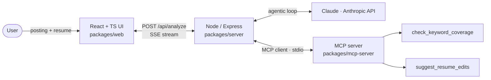

# Job-Fit Analyzer

> Paste a job posting and a resume. Claude scores the fit and lists which requirements are covered versus missing, grounded by a custom MCP server so the result is checked, not hallucinated.


The point of this project is the architecture, not the feature. A **React + TypeScript**
front-end talks to a **Node/Express** backend that runs an **agentic Claude loop**. That loop
calls a **custom MCP (Model Context Protocol) server** for the one thing an LLM should not be
trusted to decide on its own: whether a specific skill literally appears in the resume. That
deterministic tool is what keeps the analysis grounded instead of hallucinated.

## Architecture



Two deterministic tools on the MCP server (no LLM) decide the facts: `check_keyword_coverage`
and `suggest_resume_edits`. The model orchestrates and chains them; the tools ground every claim.

Flow of one analysis:

1. Claude reads the posting and extracts a short list of concrete requirements.
2. Claude calls `check_keyword_coverage(resume_text, requirements)` on the MCP server.
   The server matches deterministically — no model involved — handling aliases
   (JS↔JavaScript, Node.js↔NodeJS), light stemming (design↔designing), and experience
   qualifiers ("3 years React" → "React"). It returns each requirement's match type and
   the resume evidence.
3. For anything missing, Claude **chains** to `suggest_resume_edits(resume_text, missing)`,
   which bridges each gap from a same-category skill already in the resume.
4. Claude writes the fit score, strengths, and gaps **using only the tools' results as
   ground truth**. That is the anti-hallucination story: the model orchestrates, the tools
   decide what's actually in the resume.

## Requirements matched to what each layer proves

| Layer | Demonstrates |
| --- | --- |
| `packages/web` | ReactJS, TypeScript, responsive UI, streaming responses |
| `packages/server` | Node backend integration, agentic workflow, Claude API |
| `packages/mcp-server` | Model Context Protocol server, deterministic grounding, tool chaining |

## Run it

```bash
npm install
cp .env.example .env      # then paste your ANTHROPIC_API_KEY into .env
npm run dev               # builds the MCP server, then starts API + web
```

- Web: http://localhost:5173
- API: http://localhost:8787

**No API key yet?** It still runs. Without `ANTHROPIC_API_KEY` the app drops into a demo
mode that exercises both MCP tools directly (coverage, then the chained edit suggestions —
deterministic, no LLM) so you can see the pipeline end-to-end before wiring up billing.

## Deploy (Render Blueprint)

`render.yaml` in the repo root deploys both services in one go:

- **API** (`job-fit-analyzer-api`) — Node web service. Persistent, not serverless,
  because it spawns the MCP server as a child process and streams SSE.
- **Web** (`job-fit-analyzer-web`) — static Vite build served from a CDN.

Steps:

1. In Render, **New → Blueprint**, connect this repo. Render reads `render.yaml`.
2. On the **API** service, set `ANTHROPIC_API_KEY` (marked `sync: false` so it stays
   out of git). Without it the API still runs in demo mode.
3. The web is pointed at the API via `VITE_API_BASE`
   (`https://job-fit-analyzer-api.onrender.com`). If Render appended a suffix to the
   API's name, update that env var on the web service and redeploy.

The web reads `VITE_API_BASE` at build time; locally it's unset, so the Vite dev proxy
forwards `/api` to `:8787`.

## Next steps

- [x] Render the streamed Markdown properly (add `react-markdown`).
- [x] Smarter matching in the MCP tool (aliases, stemming, "3 years React" → "React").
- [x] A second MCP tool (`suggest_resume_edits`) that Claude chains after coverage.
- [ ] Persist past analyses; add a share link.
